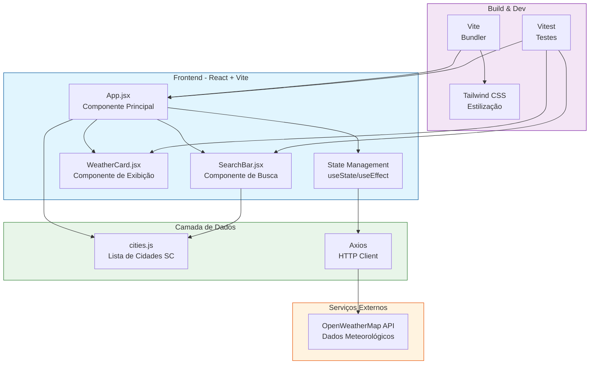

# Arquitetura do MVP-POS (Weather App)

## Diagrama de Arquitetura



## Descrição dos Componentes

| Camada | Componente | Descrição |
|--------|------------|-----------|
| **Client** | `App.jsx` | Componente principal que gerencia estado e requisições |
| **Client** | `SearchBar.jsx` | Componente de busca de cidades |
| **Client** | `WeatherCard.jsx` | Exibição dos dados meteorológicos |
| **Data** | `cities.js` | Lista estática de cidades de Santa Catarina |
| **External** | OpenWeatherMap API | API externa para dados climáticos |
| **Build** | Vite | Bundler para desenvolvimento e build |
| **Build** | Tailwind CSS | Framework de estilização |
| **Build** | Vitest | Framework de testes |

## Fluxo de Dados

1. Usuário interage com `SearchBar` para buscar uma cidade
2. `App.jsx` faz requisição via **Axios** para a **OpenWeatherMap API**
3. Dados retornados são armazenados no estado local
4. `WeatherCard` renderiza as informações para o usuário

## Estrutura de Arquivos

```
src/
├── App.jsx              # Componente principal
├── main.jsx             # Entry point React
├── index.css            # Estilos globais (Tailwind)
├── components/
│   ├── SearchBar.jsx    # Componente de busca
│   └── WeatherCard.jsx  # Card de exibição do clima
├── data/
│   └── cities.js        # Lista de cidades SC
└── test/
    ├── App.test.jsx
    ├── SearchBar.test.jsx
    ├── WeatherCard.test.jsx
    └── setupTests.js
```